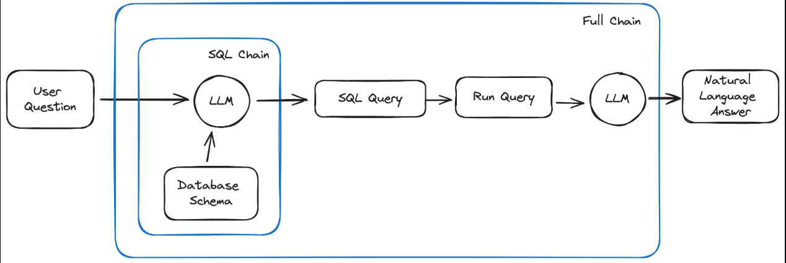

# 🗃️ Chat with MySQL (LLM-Powered)

This is a Streamlit-based chatbot interface that allows users to ask natural language questions about a MySQL database. It uses an LLM (like Groq's LLaMA3) to generate SQL queries from user prompts, runs them on the connected database, and provides clear, concise natural language answers.

---

## 📌 Project Flow

Below is the architecture of the project:

### Breakdown:

- **User Question**: A natural language question is entered via Streamlit UI.
- **SQL Chain (LLM)**: The LLM is given the database schema and asked to generate a valid SQL query.
- **Query Execution**: The query is validated and run on the connected MySQL database.
- **Response Generation (LLM)**: The result is fed back into the LLM to generate a natural language answer.

---

## 🔧 Features

✅ Connect to any MySQL database  
✅ Auto-generate SQL from natural language  
✅ Validate and sanitize SQL queries  
✅ View generated SQL and results  
✅ Easily debug with full query history  
✅ Friendly chatbot interface using Streamlit

---
